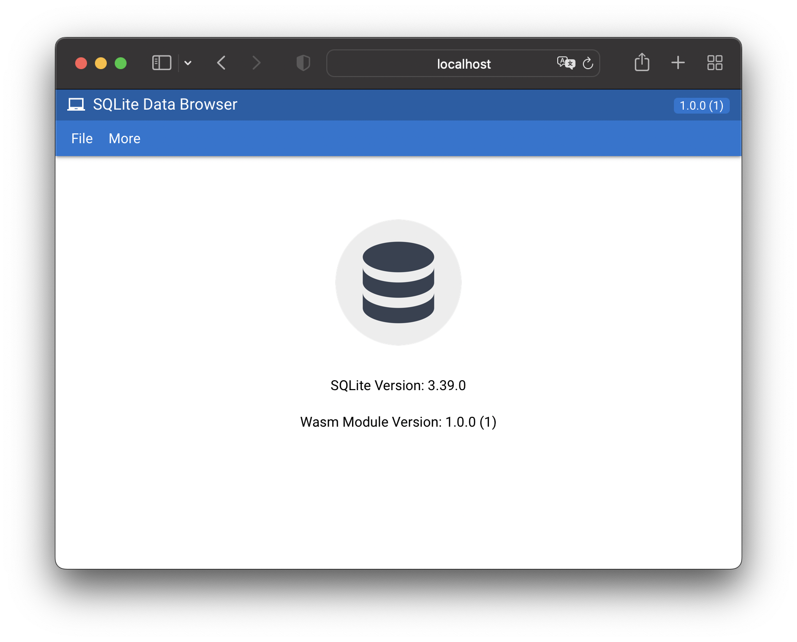

# SQLite Data Browser (BETA)

This is a SQLite data browser made with Web Assembly with C++ and web frameworks like Vue JS, Vite JS and Quasar.

    

## Web Application

    Open this website to see this application:
     
    <a href="https://sqlitedb.github.io">https://sqlitedb.github.io</a>

## Demo

    To open the application with demo database as parameter, open this website:
     
    <a href="https://sqlitedb.github.io/?f=https://sqlitedb-app.s3.amazonaws.com/files/northwind.db">https://sqlitedb.github.io/?f=https://sqlitedb-app.s3.amazonaws.com/files/northwind.db</a>

## Screenshot

    

## Tools

- Nativium: [https://github.com/nativium/nativium](https://github.com/nativium/nativium)
- Emscriptem: [https://emscripten.org/](https://emscripten.org/)
- Conan: [https://conan.io/](https://conan.io/)
- SQLite: [https://sqlite.org/](https://sqlite.org/)
- Vue JS: [https://vuejs.org/](https://vuejs.org/)
- Vite JS: [https://vitejs.dev/](https://vitejs.dev/)
- Quasar: [https://quasar.dev/](https://quasar.dev/)
- Github Actions: [https://docs.github.com/en/actions](https://docs.github.com/en/actions)
