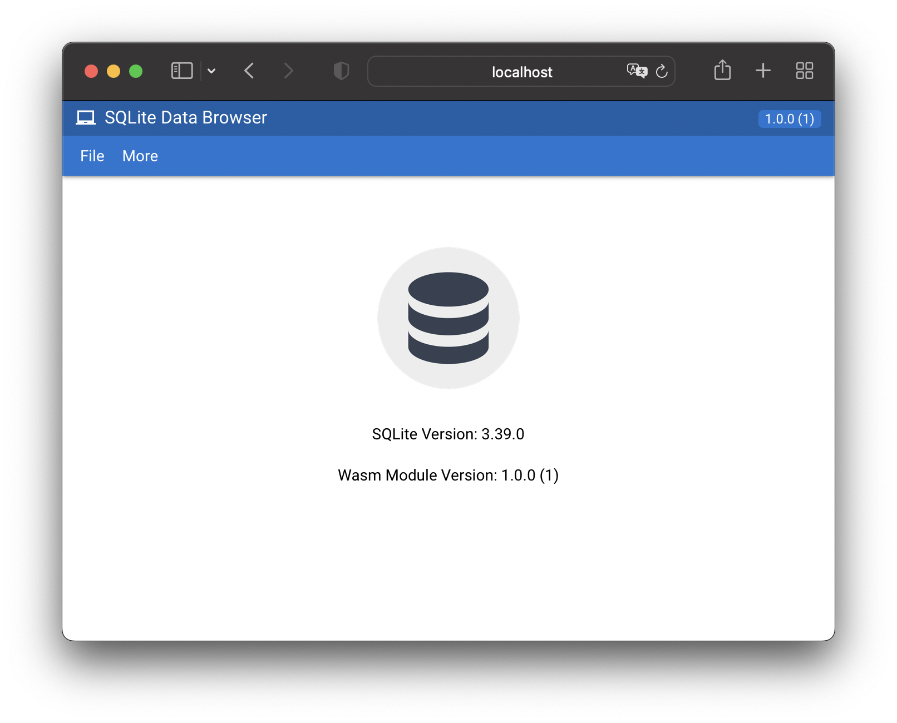

# SQLite Data Browser (BETA)

This is a SQLite data browser made with Web Assembly.

    
    

## Web Application

    Open this website to see this application:
     
    <a href="https://sqlitedb.netlify.app">https://sqlitedb.netlify.app</a>

 

    

## Screenshot

    

